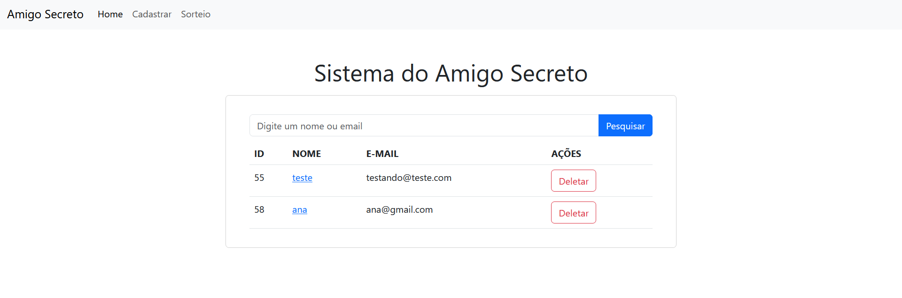

# Sistema de Amigo Secreto

Este é um sistema simples para organizar um sorteio de Amigo Secreto. O sistema permite que os participantes se cadastrem e façam o sorteio de forma aleatória.

## Requisitos

- PHP (versão 7 ou superior)
- MySQL
- Servidor web (por exemplo, Apache)

## Como Rodar

### Instale o XAMPP:
Baixe e instale o XAMPP em seu sistema operacional seguindo as instruções no site oficial.
Inicie os serviços Apache e MySQL no painel de controle do XAMPP.

### Importe a Estrutura do Banco de Dados:
Abra o MySQL Workbench.

Importe a estrutura do banco de dados a partir do arquivo fornecido no arquivo compactado, dentro da pasta "modelagem". Use o forward engineer do MySQL Workbench para criar o banco de dados físico. 

### Copie os Arquivos do Código-Fonte:
Extraia o conteúdo do arquivo compactado do código-fonte em um diretório de sua escolha.

### Acesse o Programa:
Inicie o servidor PHP com XAMPP ou com o servidor de testes do PHP.
Abra um navegador da web e digite http://localhost na barra de endereços.
Você deve ver a página inicial do programa do Amigo Secreto.